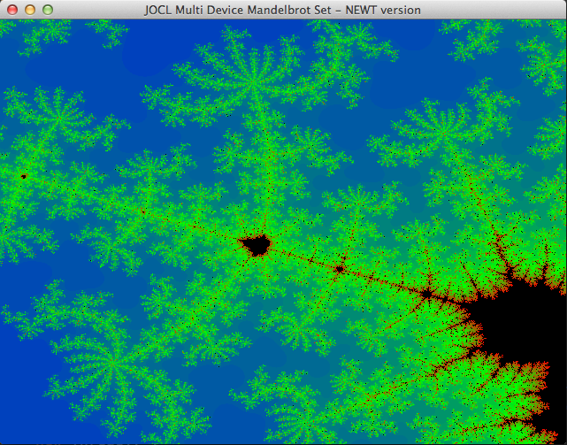
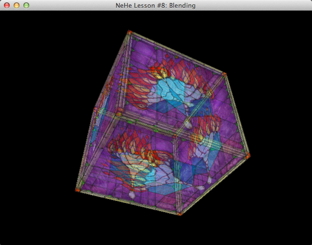

JOGL Examples
=============

### and related modules, eg: JOAL & JOCL ###

In my quest to learn about OpenGL I've come across tons of examples, most of them out-dated. This seems to be the case for a lot of the JOGL examples I've found. This repo has been setup with the following goals in mind:

 * Use Maven to handle dependencies to ensure that the examples compile with the latest JOGL libs
 * Prefer NEWT over Swing/AWT
 * Use the most recent GL Profile available to Linux, Windows and Mac (Mac OS X support being the hold up)
 * Over time replace all GL2 examples with GL3/GL4 equivalent.
 * Keep the code readable (see Clean Code by Robert C. Martin)

 > Even on OSX Mavericks (in which GLview states 4.1 is available) GL 2.1 is the latest profile available in JOGL

There will be demos by various authors. I will ensure that `@author` comments remain in the code. There will be changes from the originals.

## Running the code ##
As mentioned above, Maven is used to handle dependencies so you should ensure it's available on your system. I recommend using Intellij IDEA to open the project via the pom file.

